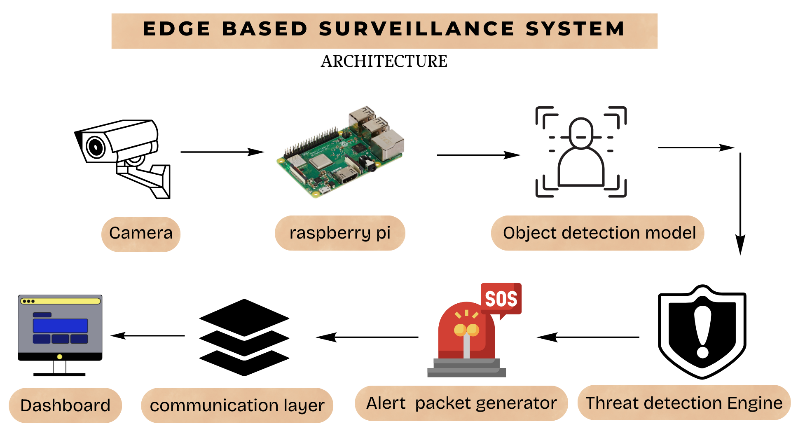
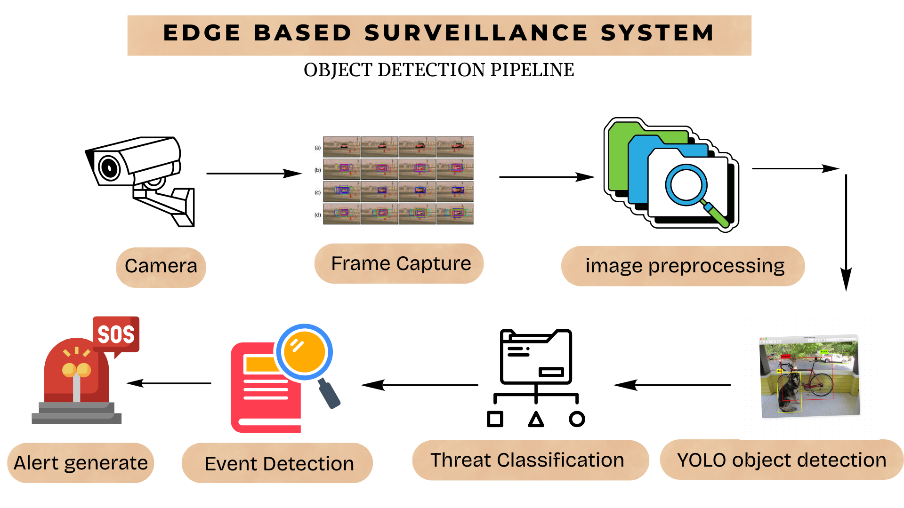

# Intelligent Edge Surveillance System
### Autonomous Monitoring for Remote and Low-Connectivity Environments

This project proposes a **smart edge-based surveillance system** designed for monitoring remote areas where traditional internet-based surveillance infrastructure is unreliable or unavailable.

The system performs **real-time object detection directly on an edge device**, reducing dependence on cloud infrastructure and minimizing bandwidth usage. Instead of transmitting continuous video streams, the system sends **compact alert packets containing only critical information**, enabling efficient monitoring in low-connectivity environments.

---

# Problem Statement

Surveillance infrastructure in rural and remote areas is often limited due to:

- unreliable internet connectivity  
- high bandwidth requirements of traditional CCTV systems  
- reliance on centralized cloud processing  

Conventional IoT-based surveillance systems continuously transmit video to remote servers. This results in:

- high data consumption  
- network congestion  
- delayed threat detection in low connectivity environments  

As a result, critical events such as:

- farm theft  
- wildlife entering human habitats  
- illegal forest activity  
- safety risks along remote railway tracks  

often go **undetected or are detected too late**, leading to economic loss, safety risks and environmental conflict.

---

# Proposed Solution

We propose a **distributed edge-based surveillance node** capable of performing **local AI-based monitoring**.

The system uses lightweight computer vision models to analyze camera input **directly on the device**.

Instead of streaming entire video feeds, the node extracts **relevant events** and transmits **small alert packets** containing:

- detected object type  
- event timestamp  
- event location  
- threat score

These alerts are sent to a monitoring interface for quick response.

The system is powered using a **solar energy module**, allowing continuous deployment in remote environments such as:

- farms  
- forests  
- railway monitoring sites  

---

# Key Innovation

The system combines **edge computing, machine learning and low-power deployment** to build a scalable rural surveillance solution.

Key innovations include:

### Edge-Based Object Detection
Real-time threat detection occurs directly on the device using lightweight ML models.

### Event-Driven Communication
Instead of continuous video streaming, only important events are transmitted.

### Low Bandwidth Operation
This significantly reduces network dependency and data usage.

### Solar Powered Deployment
The system operates using solar power with battery management, enabling operation in remote areas.

### Distributed Monitoring Architecture
Multiple nodes can operate independently while reporting events to a monitoring interface.

---

# System Architecture

The proposed system follows a distributed edge computing architecture:



The edge node performs **local inference**, ensuring that only important alerts are transmitted rather than raw video streams.

---

# Machine Learning Pipeline

The system processes camera input through a lightweight computer vision pipeline:



This enables **real-time threat detection with minimal computational overhead**.

---

# Event Alert Packet Structure:
{
 object: "animal",
 location: "node_03",
 timestamp: "2026-03-10T16:22",
 threat_score: 0.82
}

---
# Technology Stack

### Edge Hardware
- Raspberry Pi
- Camera Module

### Computer Vision
- YOLO Object Detection

### Programming
- Python
- OpenCV

### Machine Learning
- TensorFlow / PyTorch

### Data Processing
- NumPy
- Scikit-learn

### Interface & Dashboard
- Flask / Node.js based alert dashboard

### Power System
- Solar panel with battery management system

---

## Project Setup (Development)

Clone the repository:

```bash
git clone https://github.com/Reedddeb-12/iot-drone-defense-system
cd iot-drone-defense-system
```

Create and activate a Python virtual environment:

```bash
python -m venv venv
source venv/bin/activate
```

For Windows:

```bash
venv\Scripts\activate
```

Install required dependencies:

```bash
pip install opencv-python numpy scikit-learn torch torchvision flask
```

Run the object detection module:

```bash
python code/ml/detection.py
```

Run the monitoring dashboard:

```bash
cd code/frontend
npm install
npm start
```

### Development Status

The repository currently contains the system architecture, machine learning pipeline, and communication framework for the edge surveillance system. Hardware deployment and real-time field testing are part of the next development phase.

---

# Applications

The system can be deployed in multiple real-world scenarios.

### Agriculture Security
Detect crop theft and unauthorized human or animal activity in farmland.

### Wildlife Monitoring
Detect wildlife entering human settlements and monitor protected forest areas.

### Railway Infrastructure Monitoring
Identify obstacles, animal crossings or human presence along remote railway tracks.

### Rural Infrastructure Protection
Monitor solar farms, water infrastructure and communication towers.

### Community Safety
Enable village-level perimeter monitoring where traditional CCTV systems are impractical.

---

# Target Users

The system is designed for organizations that require monitoring in remote or rural environments.

**Primary stakeholders include:**

- Farmers and agricultural landowners  
- Forest and wildlife departments  
- Railway authorities  
- Rural infrastructure operators  
- Government and local administrations

---

# Future Scope

Future versions of the system can incorporate **Software Defined Radio (SDR)** communication.

SDR can enable:

- long-range communication  
- adaptive modulation techniques  
- secure wireless transmission  
- reliable communication in adversarial or unreliable network environments

This will further improve system resilience in remote monitoring scenarios.

---

# Repository Overview:
The repository is organized into multiple modules:

- `code/` – core implementation modules
- `system-design/` – architecture and system workflow
- `ml-docs/` – machine learning pipeline documentation
- `hardware/` – hardware design concepts
- `docs/` – system diagrams
- `prototype/` – development roadmap


---

# Project Status

Current development stage:

- System architecture design completed  
- Machine learning pipeline defined  
- Edge computing framework planned  
- Prototype implementation in progress

Hardware prototype and deployment testing will be implemented in the next phase.

---

# License

This project is released under the MIT License.